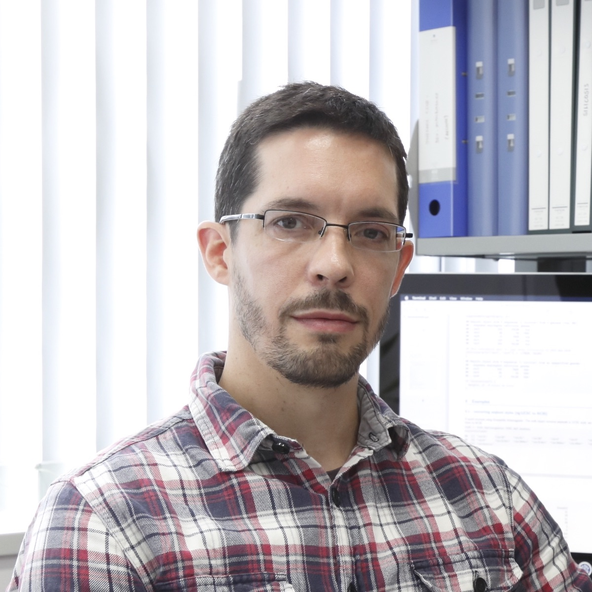

 

I am a computational biologist and co-leader of the [Quantitative Immunology Research Unit](http://qimm.ifrec.osaka-u.ac.jp/en/index.html) at the [Immunology Frontier Research Center](http://www.ifrec.osaka-u.ac.jp/en/), [Osaka University](http://www.osaka-u.ac.jp/en/). My interests include systems immunology, and gene regulatory networks. In this site I will show some of my past and current projects.
